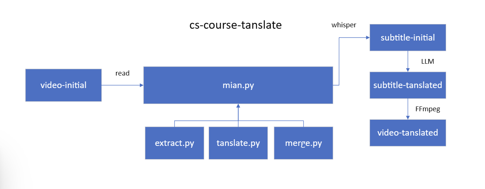
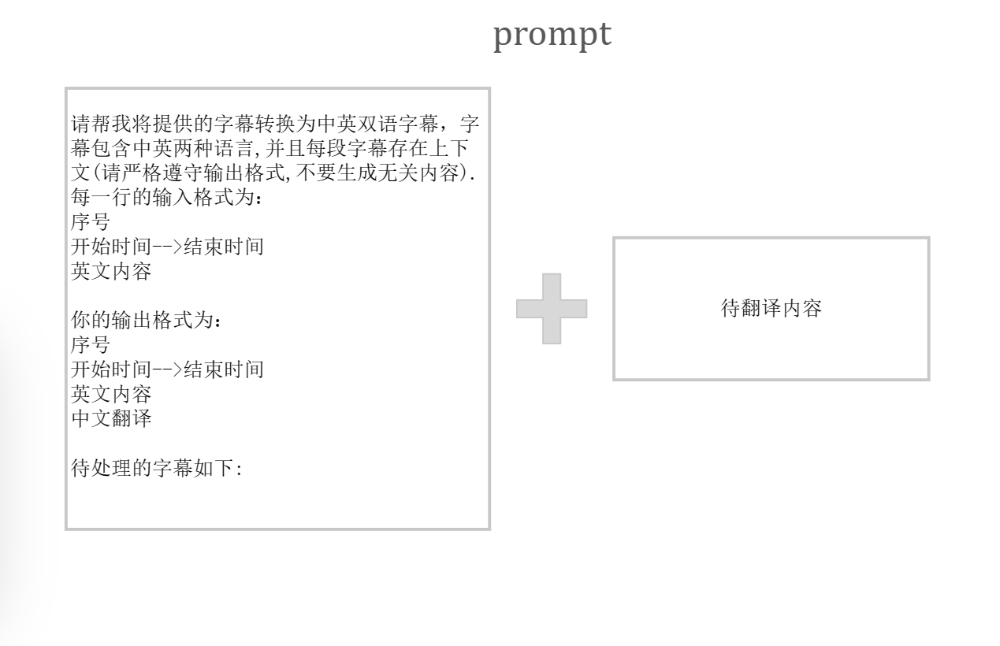
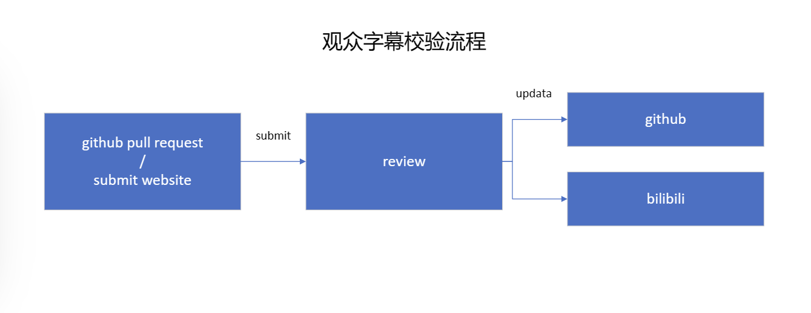
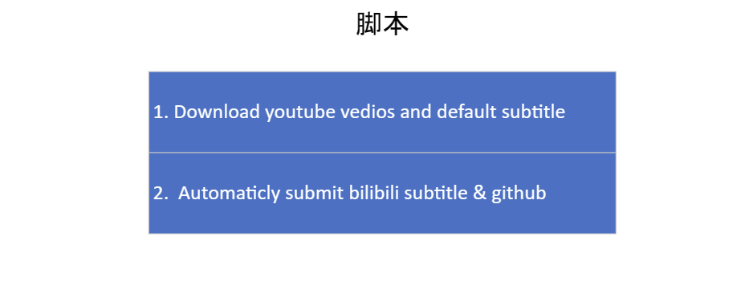
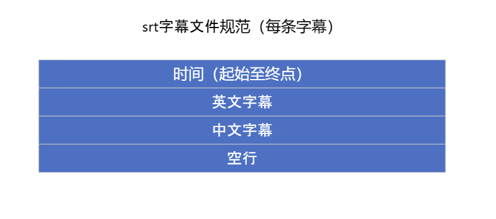

# cs-subtitle

简体中文 | [English](README_en.md)

已经翻译的系列视频上传于 [Bilibili](https://space.bilibili.com/3546392142285480?spm_id_from=333.1007.0.0), srt 文件已经同步于 `Github` 仓库, 如有错误, 可以提 issue

更多想要翻译的系列, 可以提 issue, 需要提供视频地址以及简要概括其内容和特点

## 前言

### 介绍

将英文翻译成中文，并生成双语字幕。

在这个项目中，有三步骤生成视频字幕：

- 第一步：提取：从视频中提取字幕为srt格式。(可选)
- **第二步：翻译：调用 [Google Gemini-3.5-flash api](https://ai.google.dev/gemini-api/) 翻译字幕。(阅读API文档以了解更多信息)**
- 第三步：合并：合并视频和字幕。(可选)

（可以很容易地支持更多语言）。

### 声明

LLM 的输出并不总是完美的，因此字幕可能不准确（也许改进提示可以使其更好），因此并项目设立 `Subtitle Review` 用于收集观众的反馈，从而改进字幕体验。

- 翻译错误是不可避免的，一些代码只是试图减少发生的概率。
- 如果有错误，请删除生成的字幕文件并重试。
- 如果你有解决问题的好方法，分享是一个不错的主意。

prompt 示例：

## 基本流程

如果你有视频的srt文件，你只需要按照基本流程（**第二步**）：

- 将Gemini api复制到api.key。
- 将文件放在 `.\subtitle\your_subtitle_folder` `main.py`会遍历这些文件。（需要在 `.\subtitle` 下创建一个文件夹，以下相同）
- 运行 `main.py` 。

## 完整流程

### 第一：提取（开发中）

借助 Openai 的 Whisper 。

- 将视频文件放入视频文件夹。
- 配置 [Whisper](https://github.com/openai/whisper) 依赖环境。

### 第二：翻译

在这个项目中，你需要：

- 获取 [Gemini api](https://ai.google.dev/gemini-api/) 提供的 api 。(实际上 Openai api 也是可行的) 复制到 `api.key` 文件。
- 在 `translate.py` 中有一些默认参数，如RPM（请求次数限制）...如果需要，它们都是可更改的。

> 由于大型语言模型输出的不稳定性, `translate.py` 中的 `retranslate` 函数尝试翻译丢失的文本。但它不能保证没有错误。

### 第三：合并（开发中）

可选：如果你不需要硬字幕，请跳过这一步。

`merge.py` 调用 `Ffmpeg` 命令来合并视频和字幕。

所以你需要：

- 下载 [Ffmpeg](https://ffmpeg.org/) 。
- 配置 `Ffmpeg` (将其设置在系统路径中) 。

### 运行 `main.py`

在此之前，你需要确保环境中的配置正确。

- [Whisper](https://github.com/openai/whisper), [Pytorch](https://pytorch.org/)。
- [Gemini api](https://ai.google.dev/gemini-api/)
- [Ffmpeg](https://ffmpeg.org/)
- Python 依赖库：查看代码，并安装所需的库。

## 字幕审查

> 正在开发中...（需要帮助）

为了解决由LLM产生的翻译错误问题。

收集观众的反馈是个好主意：

需要的脚本：

## 更多信息

### 补充说明

- Openai api 是可选的，只需更改 `translate.py` 文件。（文件注释中提供了示例）
- 为了提高效率，最好在运行 Whisper 时使用显卡。
- 代码的某些地方是冗余的，因此仍有提升的空间，特别是在执行 Ffmpeg 生成和 srt 翻译时的 IO 操作。
- srt 文件标准：

### 开发计划

- `extract.py`, `merge.py` 开发, 代码重构
- `subtitle review` 开发
- 命令行开发
- 直接下载 Youtube 视频

### 测试示例

[初始视频](https://www.youtube.com/watch?v=3LPJfIKxwWc&list=PLhQjrBD2T381WAHyx1pq-sBfykqMBI7V4)

[带字幕的视频](https://www.bilibili.com/video/BV1qyhwezEyK/?spm_id_from=333.999.0.0)

### 联系

QQ 群：700328548

[Telegram 群](https://t.me/+3T4VLyX548gyMGU1)
