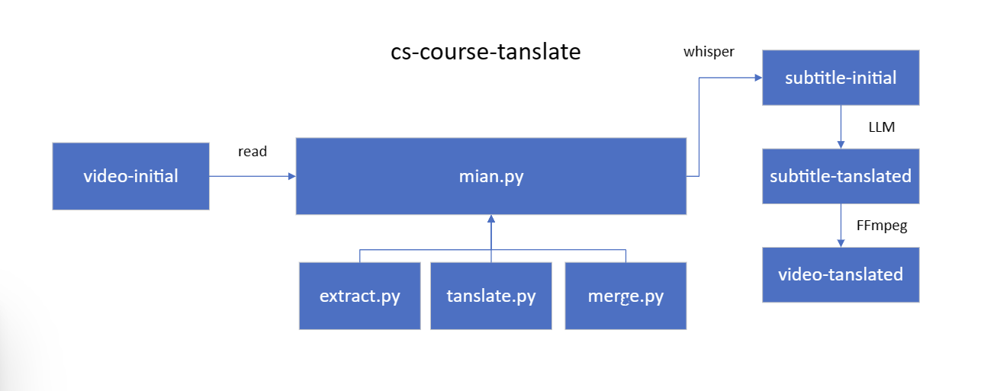
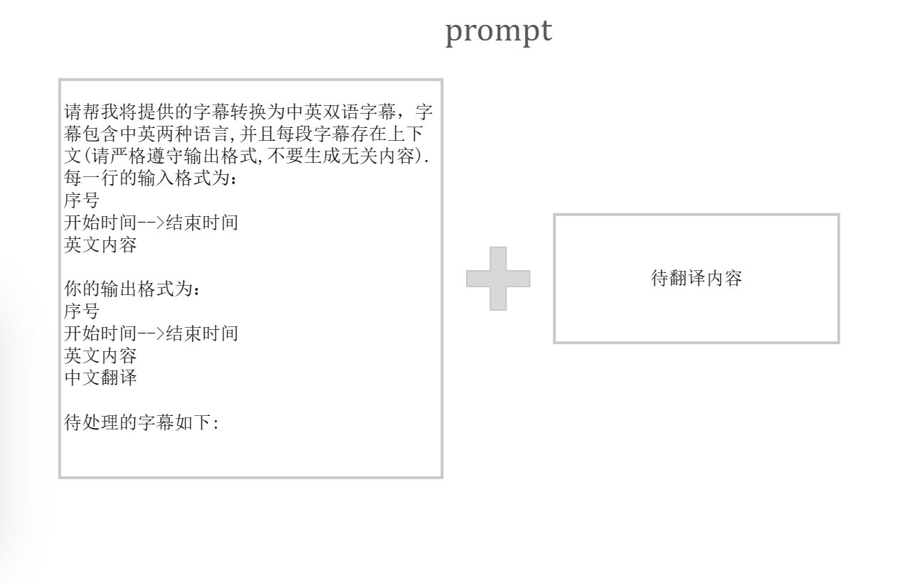
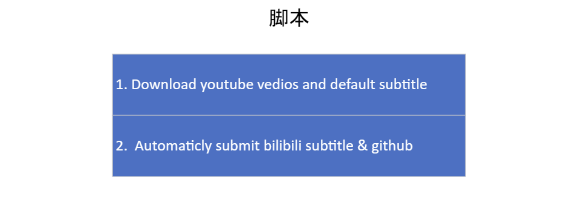
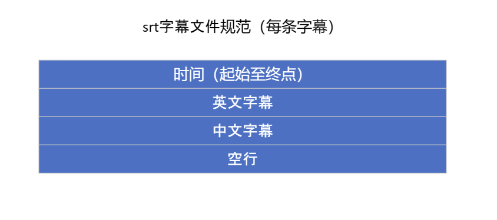

# cs-subtitle

English | [简体中文](README.md)

## Preface

### Introduction

Tanslate the English to Chinese, and generate bilingual subtitles.

In this project, There are three steps to generate subtitles for the videos.

- STEP1. Extract: extracte the subtitles from the videos as srt format. (Optional)
- **STEP2. Translate: call [Google Gemini-3.5-flash api](https://ai.google.dev/gemini-api/) to tanslate the subtitles. (Read API docs to learn more information)**
- STEP3. Merge: merge the video and the stbtitles. (Optional)

(It's easy to support more language in your hands).

### Statement

LLM's output is not always perfect, so the subtitles aren't accurate (Maybe imporving the prompt can make it better), so here set a `Subtitle Review` item to collect the feedback of the audience to improve the subtitles.

- Tanslation errors are not avoidable, some code just try to redudce the probability.
- When there are some errors please delete the files generated and try again.
- If you have good idea to solve the problem. It's a good idea to share it.

Sample prompt:

## Basic Process

If you have the srt file of the video, you just need to follow basic process (**STEP2.**):

- Copy Gemini api to api.key.
- Put the file in `.\subtitle\your_subtitle_folder` `main.py` will go through each of these files. (Need to create a folder below `.\subtitle` , Same below)
- Run main.py.

## Complete Process

### First: Extract (developing)

With the help of whisper made by openai.

- Put the video file in the video folder.
- Configure [Whisper](https://github.com/openai/whisper) dependency enviroment.

### Second: Translate

In this project, you need to:

- get the api provided by [Gemini api](https://ai.google.dev/gemini-api/). (Actually Openai api is also feasible)
Copy it to the `api.key` file.
- There some default paraments like RPM(the requirement times limit) in `translate.py`...If you need, they are all changable.

> Due to instability of large language model output, `retranslate function` in the `translate.py` try to tanslate the missing text. But it can't promise that there is no bug.

### Third: Merge (developing)

Optinonal: If you don't need hard subtitles, just pass this STEP3.

`merge.py` call `Ffmpeg` command to merge the video and subtitle.

So you need to:

- Download [Ffmpeg](https://ffmpeg.org/).
- Configure `Ffmpeg` (Set it in system path).

### Run the `main.py`

Before it, you need make sure the configuration in the environment are correct.

- [Whisper](https://github.com/openai/whisper), [Pytorch](https://pytorch.org/).
- [Gemini api](https://ai.google.dev/gemini-api/)
- [Ffmpeg](https://ffmpeg.org/)
- Python dependency library: Review the code, and install libraries it needed.

## Subtitle Review

> waiting to be develop... (need help)

To solve the problem of tanslaton errors producted by LLM.

It's a good idea to collect the feedback of audience: 

Script needed: 

## More Information

### Added Details

- Openai api is optional just change the `tanslate.py` file. (Sample has been provided in the file's comments)
- For efficiency, it is best to use a graphics card when run whisper.
- Somewhere of the code is redundant, so there is still have space to enhance, especially the IO operations like when perform ffmpeg generation and srt tanslation.
- srt file standard: 

### Developing Plan

- `extract.py`, `merge.py` develop, and  code rewrite
- `subtitle review` develop
- command line develop
- Download Youtube videos directly

### Test Examples

[Initial video](https://www.youtube.com/watch?v=3LPJfIKxwWc&list=PLhQjrBD2T381WAHyx1pq-sBfykqMBI7V4)

[Subtitled video](https://www.bilibili.com/video/BV1tYeBeeEk4/?share_source=copy_web&vd_source=34e7d6e2081c3f2ce5f5123116b3beaf)

### Contact

QQ Grouop：700328548

[Telegram Group](https://t.me/+3T4VLyX548gyMGU1)
